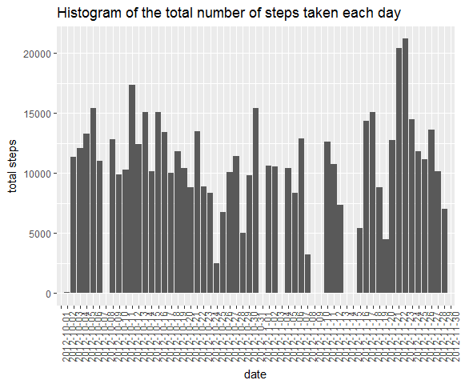
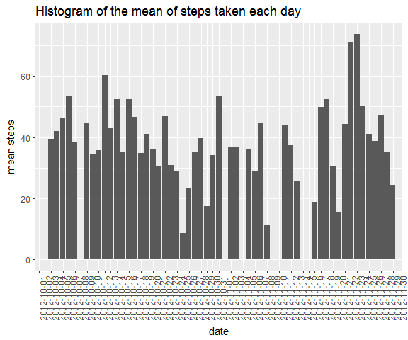
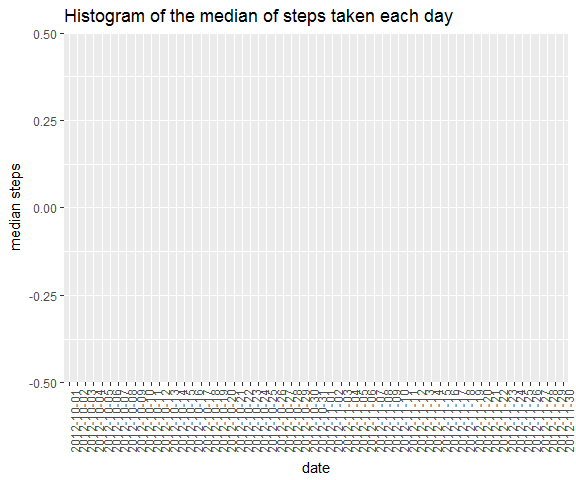
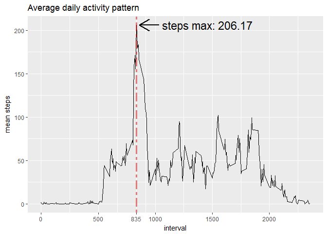
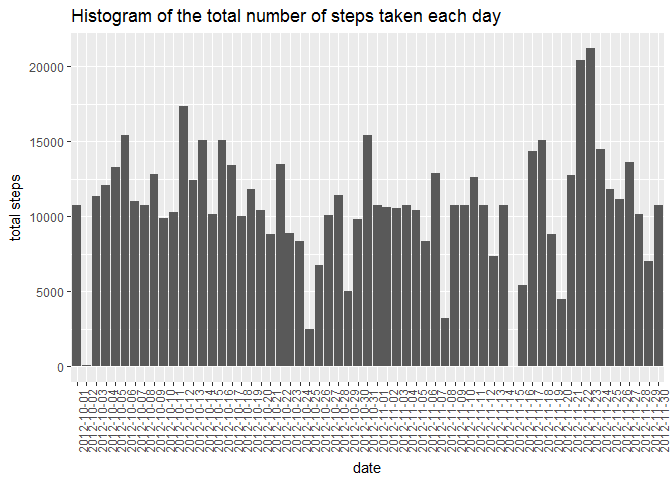
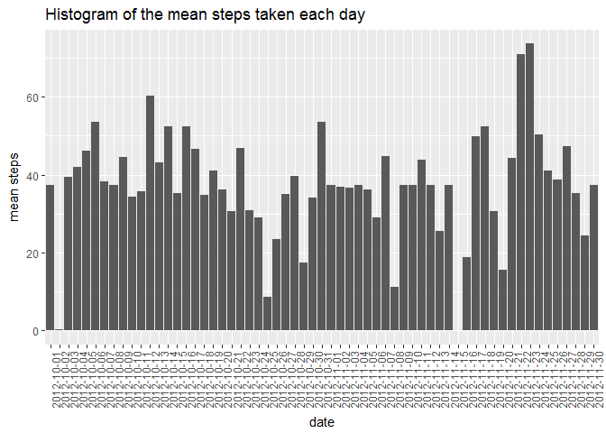
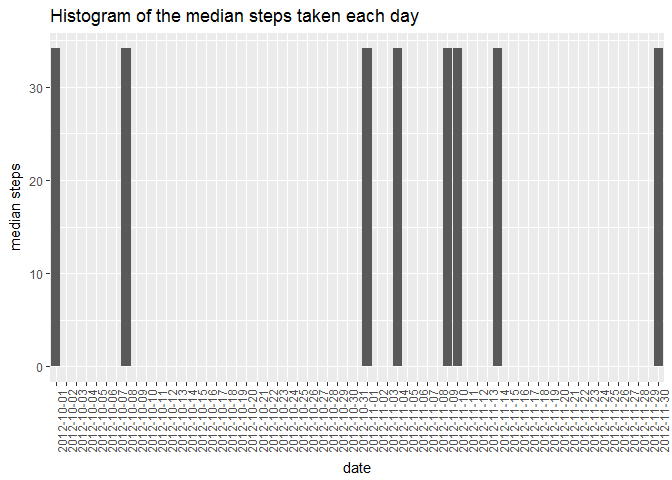
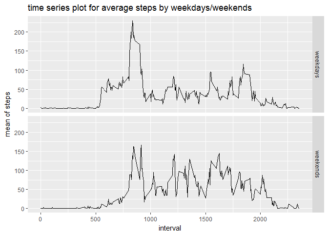

    knitr::opts_chunk$set(cache = T,echo = T)

Loading and preprocessing the data
----------------------------------

-   unzip file

<!-- -->

    if(!file.exists("activity.csv")){
      unzip("repdata_data_activity.zip")
    }

-   load packages

<!-- -->

    library(ggplot2)
    library(dplyr)

    ## 
    ## Attaching package: 'dplyr'

    ## The following objects are masked from 'package:stats':
    ## 
    ##     filter, lag

    ## The following objects are masked from 'package:base':
    ## 
    ##     intersect, setdiff, setequal, union

    library(data.table)

    ## data.table 1.10.0

    ##   The fastest way to learn (by data.table authors): https://www.datacamp.com/courses/data-analysis-the-data-table-way

    ##   Documentation: ?data.table, example(data.table) and browseVignettes("data.table")

    ##   Release notes, videos and slides: http://r-datatable.com

    ## -------------------------------------------------------------------------

    ## data.table + dplyr code now lives in dtplyr.
    ## Please library(dtplyr)!

    ## -------------------------------------------------------------------------

    ## 
    ## Attaching package: 'data.table'

    ## The following objects are masked from 'package:dplyr':
    ## 
    ##     between, first, last

-   load data

<!-- -->

    df<-read.csv("activity.csv")

-   view into data

<!-- -->

    dim(df)

    ## [1] 17568     3

    str(df)

    ## 'data.frame':    17568 obs. of  3 variables:
    ##  $ steps   : int  NA NA NA NA NA NA NA NA NA NA ...
    ##  $ date    : Factor w/ 61 levels "2012-10-01","2012-10-02",..: 1 1 1 1 1 1 1 1 1 1 ...
    ##  $ interval: int  0 5 10 15 20 25 30 35 40 45 ...

    head(df)

    ##   steps       date interval
    ## 1    NA 2012-10-01        0
    ## 2    NA 2012-10-01        5
    ## 3    NA 2012-10-01       10
    ## 4    NA 2012-10-01       15
    ## 5    NA 2012-10-01       20
    ## 6    NA 2012-10-01       25

    tail(df)

    ##       steps       date interval
    ## 17563    NA 2012-11-30     2330
    ## 17564    NA 2012-11-30     2335
    ## 17565    NA 2012-11-30     2340
    ## 17566    NA 2012-11-30     2345
    ## 17567    NA 2012-11-30     2350
    ## 17568    NA 2012-11-30     2355

What is mean total number of steps taken per day?
-------------------------------------------------

    q2<-df%>%
      group_by(date)%>%
      summarize(total=sum(na.omit(steps)),mean=mean(na.omit(steps)),median=median(na.omit(steps)))

    head(q2)    #view into data

    ## # A tibble: 6 × 4
    ##         date total     mean median
    ##       <fctr> <int>    <dbl>  <dbl>
    ## 1 2012-10-01     0      NaN     NA
    ## 2 2012-10-02   126  0.43750      0
    ## 3 2012-10-03 11352 39.41667      0
    ## 4 2012-10-04 12116 42.06944      0
    ## 5 2012-10-05 13294 46.15972      0
    ## 6 2012-10-06 15420 53.54167      0

    ggplot(q2,aes(date,total))+
      geom_histogram(stat = "identity")+
      labs(title="Histogram of the total number of steps taken each day",y="total steps")+
      theme(axis.text.x = element_text(angle = 90))

    ## Warning: Ignoring unknown parameters: binwidth, bins, pad

    ggplot(q2,aes(date,mean))+
      geom_histogram(stat="identity")+
      labs(title="Histogram of the mean of steps taken each day",y="mean steps")+
      theme(axis.text.x = element_text(angle = 90))

    ## Warning: Ignoring unknown parameters: binwidth, bins, pad

    ## Warning: Removed 8 rows containing missing values (position_stack).

    ggplot(q2,aes(date,median))+
      geom_histogram(stat="identity")+
      labs(title="Histogram of the median of steps taken each day",y="median steps")+
      theme(axis.text.x = element_text(angle = 90))

    ## Warning: Ignoring unknown parameters: binwidth, bins, pad

    ## Warning: Removed 8 rows containing missing values (position_stack).

What is the average daily activity pattern?
-------------------------------------------

    q5<-df%>%
      group_by(interval)%>%
      summarize(mean=mean(na.omit(steps)))
    q51<-q5$interval[q5$mean==max(q5$mean)]
    q52<-max(q5$mean)

    ggplot(q5,aes(interval,mean))+
      geom_line(stat="identity")+
      geom_vline(xintercept =q51,lty=6,color="red3",lwd=1.2,alpha=.5)+
      annotate("segment",x=q51+200,xend =q51+25,y=q52,yend=q52,arrow=arrow(),size=.75)+
      annotate("text",x=q51+620,y=q52,label=paste("steps max:",round(q52,2)),size=6)+
      scale_x_continuous(breaks = c(0,500,q51,1000,1500,2000))+
      labs(y="mean steps",title="Average daily activity pattern")

we can see when the time is at 8:30, it have the maximum steps taken.  
About 206.17 steps taken peer days

Imputing missing values
-----------------------

First we recap what the data look like

    head(df)

    ##   steps       date interval
    ## 1    NA 2012-10-01        0
    ## 2    NA 2012-10-01        5
    ## 3    NA 2012-10-01       10
    ## 4    NA 2012-10-01       15
    ## 5    NA 2012-10-01       20
    ## 6    NA 2012-10-01       25

    tail(df)

    ##       steps       date interval
    ## 17563    NA 2012-11-30     2330
    ## 17564    NA 2012-11-30     2335
    ## 17565    NA 2012-11-30     2340
    ## 17566    NA 2012-11-30     2345
    ## 17567    NA 2012-11-30     2350
    ## 17568    NA 2012-11-30     2355

-   how many NA in data

<!-- -->

    q61<-c(length(which(is.na(df[,1]))),round(length(which(is.na(df[,1])))/nrow(df),2))
    q62<-length(which(is.na(df[,2])))
    q63<-length(which(is.na(df[,3])))
    q65<-q61+q62+q63
    q66<-data.frame(steps=q61,date=q62,interval=q63,total=q65)
    rownames(q66)<-c("quantity", "percent (%)")
    q66

    ##               steps date interval   total
    ## quantity    2304.00    0        0 2304.00
    ## percent (%)    0.13    0        0    0.13

there have 2304 NA in "steps", about 0.13% of total data.  
other variables have no missing data

-   deal with missing values

<!-- -->

    q64<-df%>%
      group_by(interval)%>%
      summarize(max=mean(na.omit(steps)))
    head(q64)

    ## # A tibble: 6 × 2
    ##   interval       max
    ##      <int>     <dbl>
    ## 1        0 1.7169811
    ## 2        5 0.3396226
    ## 3       10 0.1320755
    ## 4       15 0.1509434
    ## 5       20 0.0754717
    ## 6       25 2.0943396

I want to fill missing values with the mean for that 5-minute interval

    for(i in 1:nrow(df)){
        if(is.na(df[i,1])){
          a<-which(q64[,1]==df[i,3])
        df[i,1]<-q64[a,2]
      }
    }
    head(df)

    ##       steps       date interval
    ## 1 1.7169811 2012-10-01        0
    ## 2 0.3396226 2012-10-01        5
    ## 3 0.1320755 2012-10-01       10
    ## 4 0.1509434 2012-10-01       15
    ## 5 0.0754717 2012-10-01       20
    ## 6 2.0943396 2012-10-01       25

so the new data would like above

Histogram of the total number/mean/median of steps taken each day after
missing values are imputed would look like this

    q7<-df%>%
      group_by(date)%>%
      summarize(total=sum(steps),mean=mean(steps),median=median(steps))

    ggplot(q7,aes(date,total))+
      geom_histogram(stat = "identity")+
      labs(title="Histogram of the total number of steps taken each day",y="total steps")+
      theme(axis.text.x = element_text(angle = 90))

    ## Warning: Ignoring unknown parameters: binwidth, bins, pad

    ggplot(q7,aes(date,mean))+
      geom_histogram(stat="identity")+
      labs(title="Histogram of the mean steps taken each day",y="mean steps")+
      theme(axis.text.x = element_text(angle = 90))

    ## Warning: Ignoring unknown parameters: binwidth, bins, pad

    ggplot(q7,aes(date,median))+
      geom_histogram(stat="identity")+
      labs(title="Histogram of the median steps taken each day",y="median steps")+
      theme(axis.text.x = element_text(angle = 90))

    ## Warning: Ignoring unknown parameters: binwidth, bins, pad

Are there differences in activity patterns between weekdays and weekends?
-------------------------------------------------------------------------

-   indicating whether the day data give is a weekday or weekend day

<!-- -->

    q8<-df%>%
      mutate(week=weekdays(as.POSIXct(df$date)))

    q8<-q8%>%
      mutate(week2=ifelse(week%in%c("星期一","星期二","星期三","星期四","星期五"),"weekdays","weekends"))

the levels of weekdays/weekends variable

    levels(as.factor(q8$week2))

    ## [1] "weekdays" "weekends"

-   panel plot containing a time series plot of the 5-minute interval
    and the average number of steps taken

<!-- -->

    q81<-q8%>%
      group_by(week2,interval)%>%
      summarize(mean=mean(steps))
    ggplot(q81,aes(interval,mean))+
      geom_line(stat="identity")+
      labs(title="time series plot for average steps by weekdays/weekends",y="mean of steps")+
      facet_grid(week2~.)

